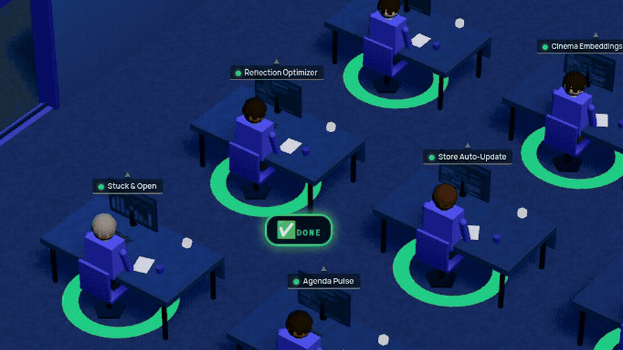

<div align="center">


# Kernl

### Agent teams that do your work — on your own machine.

**Kernl is a self-hosted server that hands any LLM your real data — tasks, mail, calendar, finance, contacts — and runs teams of agents that act on it. No account, no cloud, nothing leaves the box.**

<p>
  <a href="https://github.com/fastslack/kernl/stargazers"></a>
  <a href="https://github.com/fastslack/kernl/releases"></a>
  <a href="./LICENSE"></a>
  
  
</p>

<a href="#-install-in-one-line"><b>Install</b></a> · <a href="#-watch-them-work"><b>Watch them work</b></a> · <a href="#-why-kernl"><b>Why Kernl</b></a> · <a href="#-mcp-integration"><b>MCP integration</b></a> · <a href="https://lifekernl.com"><b>Website</b></a> · <a href="https://github.com/fastslack/kernl/discussions"><b>Discussions</b></a>

</div>

## 🎬 Watch them work

<div align="center">

<a href="https://lifekernl.com"></a>

<sub><b>A real instance.</b> 59 agents across twelve departments, work landing live. Not a mockup and not a render — that is the <code>/agents-flow</code> view of a running Kernl, and the one-liner below gets you to it.</sub>

</div>

<!-- Captured from a running instance at /agents-flow with
     e2e/tests/readme-office3d-shot.json — rerun that suite to refresh the
     still, then copy the newest e2e/screenshots/readme-office3d-*.png over
     docs/assets/office3d.png. The scene takes ~40s to build, which is why the
     test waits on `.hq-search-btn` (it only exists once the world is mounted)
     instead of a fixed delay, and why it strips `.update-bar` before shooting:
     a version banner dates a screenshot the moment the next release ships.

     Caveat: the suite REPORTS A TIMEOUT even though it writes the screenshot
     correctly, about two minutes in. The run record comes back with zero
     actions and zero duration, so the runner is discarding the action log
     rather than the browser failing — the same "Test timed out after Nms" that
     dominates this project's e2e history. Judge the run by the PNG it leaves
     behind, not by its exit status.

     The animated office3d.gif is rendered from the site repo's
     clips/kernl-office-16x9.mp4 (15s, 1920x1080). Note the crop: the source is a
     wide shot of the entire floor, and shrunk to fit a README column every agent
     label goes sub-legible and the DONE badges turn into specks — which defeats
     the point of showing it at all. The 2x centre crop keeps the labels and the
     badges readable, and the badges still land inside the cropped frame across
     all 15s.
       CROP="crop=960:540:480:270"
       ffmpeg -i clips/kernl-office-16x9.mp4 \
         -vf "$CROP,fps=12,scale=900:-1:flags=lanczos,palettegen=max_colors=128:stats_mode=diff" pal.png
       ffmpeg -i clips/kernl-office-16x9.mp4 -i pal.png \
         -lavfi "$CROP,fps=12,scale=900:-1:flags=lanczos[x];[x][1:v]paletteuse=dither=bayer:bayer_scale=3:diff_mode=rectangle" \
         docs/assets/office3d.gif
     That lands at ~1.9 MB, which still loads before a first-time visitor has
     finished reading the headline above it. -->

---

## ⚡ Install in one line

```bash
curl -fsSL https://raw.githubusercontent.com/fastslack/kernl/stable/install.sh | sh
```

Debian/Ubuntu, Fedora/RHEL and macOS. The same command installs *and* updates — it
reads the newest release and picks the build for your machine. On Windows, take the
`.msi` from [the latest release](https://github.com/fastslack/kernl/releases/latest).

→ Dashboard at **http://localhost:3086** · MCP endpoint at **http://localhost:3086/mcp**

Nothing to sign up for and no host paths to set. First run walks you through four
steps, and one of them is picking an LLM — a cloud key, or a local model through LM
Studio or Ollama if you would rather nothing left the machine at all. The kernel waits
for that choice before serving the rest of the API, so the dashboard cannot hand you a
screen whose every button fails.

<details>
<summary><b>Prefer Docker?</b> (adds the bundled Neo4j graph brain)</summary>

```bash
git clone https://github.com/fastslack/kernl.git
cd kernl
docker compose up -d --build

# Kernl generates an API token on first boot. Grab it:
docker compose exec kernel cat /app/data/.kernel-auth-token
```

Paste that token once into the dashboard's login screen and you're in — it's kept in
your browser and reused for every request. To pin your own instead, set
`KERNEL_AUTH_TOKEN` (`openssl rand -hex 32`) in `.env` before the first `up`. The graph
brain (Neo4j) and key-free web search come bundled in this path.

</details>

## Your AI is brilliant — and amnesiac.

Every conversation starts from zero. Your LLM can't see your tasks, read your inbox, check your budget, or remember what you told it yesterday. And the cloud "AI assistants" that promise to fix that? They want your entire life uploaded to *their* servers.

**Kernl fixes both.**

## What is Kernl?

Kernl is a **self-hosted** server that plugs your real life into **any** LLM through the [Model Context Protocol (MCP)](https://modelcontextprotocol.io) — tasks, contacts, email, finance, calendar, notes, health and more, behind one endpoint that Claude, Cursor or any MCP client can reach.

Then it goes past a data bridge: Kernl runs **agents** — autonomous teams (it calls them *offices*) that work in loops, call your tools, and finish jobs while you're away.

Everything runs on **your machine**. Your data never leaves the box.

<sub>For the depth, once you want a number: **103 tools** live on a fresh install, rising past **290** as you enable more of the **71 bundled modules**.</sub>

<div align="center"><sub><b>WORKS WITH</b></sub><br>Claude · Cursor · OpenAI · Grok · LM Studio · <b>any MCP client</b></div>

## 💬 Talk to your life

Point your AI at Kernl and ask it things it could never do before:

> 💸 *"Did rent clear, and how much did I spend on food this month?"* — reads your finance module.
>
> 📥 *"Triage my inbox and draft replies to anything urgent."* — reads your email, writes the drafts.
>
> ✅ *"What's overdue, and what's due this week?"* — straight from your real tasks + calendar.
>
> 🤖 *"Spin up the dev office and clear the next three backlog items."* — launches an agent team that works on its own.

Real data. Real actions. On your machine — not in someone else's cloud.

## 🔥 Why Kernl

|  |  |
|---|---|
| 🔒 **Private by default** | Self-hosted. Your tasks, email and finances never touch someone else's cloud. |
| 🧠 **Real memory** | A graph-backed brain (Neo4j + GDS) links every module, so your AI finally *remembers*. |
| 🤖 **Agents that act** | Not a chatbot — autonomous *offices* that work in loops and use your tools. |
| 🔌 **Any LLM, any client** | Claude, OpenAI, Grok, or a local model via LM Studio. Any MCP client connects. |
| 🧩 **Endlessly extensible** | Everything is a module. Ship your own as a portable `.kernl` package. |
| 📊 **103 tools installed, 71 modules bundled** | One surface for your whole life — not fifteen disconnected apps. Enable everything and you pass 290 tools. |

## ⚔️ Kernl vs. the usual options

|  | Cloud AI assistants | A single MCP server | "Second brain" apps | **Kernl** |
|---|:---:|:---:|:---:|:---:|
| Your data stays on your machine | ❌ | ✅ | ⚠️ | ✅ |
| Your real life — email, finance, tasks… | partial | one thing | ❌ | **71 modules** |
| Agents that *act*, not just chat | limited | ❌ | ❌ | ✅ |
| Works with any LLM & MCP client | ❌ | ✅ | ❌ | ✅ |
| Yours to extend & fork | ❌ | ⚠️ | ❌ | ✅ |

## 🧩 What's inside

**Your life, addressable by your AI** — tasks & projects, contacts/CRM, reminders, email (IMAP/SMTP), finance & budgets, calendar, notes, goals, health & training, shopping, travel, documents… 71 modules, every one exposed as MCP tools.

**A fleet of agents** — cooperating agents with chains, schedules and their own workspaces. Package a whole team as an installable `.kernl` *office*, and watch them work in a live **3D office view**.

**Pluggable everything**
- **LLM providers** — Claude, OpenAI, Grok, LM Studio (local), and more via extensions.
- **Sandbox drivers** — run agent code in Docker, CubeSandbox, or your own driver.
- **Channels** — WhatsApp, Telegram, Slack, email, Mattermost and webchat on one notification bus.

**Graph intelligence** — optional Neo4j + GDS for cross-module relationship analysis.

## 🔌 MCP integration

Kernl speaks MCP over **stdio** and **Streamable HTTP** at the same time, so every client reaches the same tools.

<details>
<summary><b>Claude Desktop / Cursor (stdio)</b></summary>

```json
{
  "mcpServers": {
    "kernl": {
      "command": "bun",
      "args": ["run", "bin/mcp-server.ts"],
      "cwd": "/absolute/path/to/kernl/services/kernel"
    }
  }
}
```
</details>

<details>
<summary><b>Any HTTP client</b></summary>

The MCP HTTP transport is at `http://localhost:3086/mcp` by default (the official Streamable HTTP spec).
</details>

## 🛠️ Build your own

An **extension** is a folder (or a packaged `.kernl`) with a `manifest.json` plus any of: a backend module (new MCP tools + HTTP routes), agents & offices, agent-scoped skills, a theme, a channel, or a sandbox driver.

Keep operator-specific material — named agents, your WhatsApp, regional scrapers — private under `services/kernel/assets/personal-agents/` (gitignored, ideal for a private submodule).

Full guide → [`docs/architecture/extension-points.md`](./docs/architecture/extension-points.md)

## 📦 More install options

<details>
<summary><b>Full stack — real-time bridge + WhatsApp</b></summary>

Adds the [mtwRequest](https://github.com/fastslack/mtwRequest) Rust server, the WhatsApp bridge, and host-coupled mounts (so on-host `claude_code` agents can edit your sibling repos). Needs a few host paths in `.env`:

```bash
git clone https://github.com/fastslack/kernl.git
cd kernl
cp .env.example .env
$EDITOR .env   # set HOST_HOME, HOST_KERNEL_ROOT, HOST_PROJECTS_ROOT,
               # KERNEL_REQUEST_SRC, KERNEL_WHATSAPP_BRIDGE_SRC
docker compose -f docker-compose.full.yml up -d --build
```
</details>

<details>
<summary><b>Local dev — no Docker</b></summary>

```bash
git clone https://github.com/fastslack/kernl.git
cd kernl
bun install --cwd services/kernel   # requires bun >= 1.3
cp .env.example .env
bun run dev                # stdio MCP + HTTP router (delega a services/kernel)
```
</details>

## Requirements

**For the one-line install: none.** The package ships its own runtime — no Bun, no
Node, no Docker. A 64-bit Debian/Ubuntu, Fedora/RHEL or macOS machine is the whole list.

Only if you build from source or run the container stack instead:

- **Bun ≥ 1.3** (primary runtime) or **Node ≥ 20** — source installs.
- **Docker + Compose** — the container paths, and the only route to the full stack.
- **Neo4j 5.x + GDS** (optional; Compose starts one for you; Kernl degrades gracefully
  without it). Budget 1–2 GB of RAM for it if you keep it.

## Configuration

Everything is environment-driven, and the install above needs **none of it** —
Kernl boots with working defaults either way. Copy `.env.example` to `.env`
only when you want to override something.

Two secrets are generated and persisted on first boot if you don't set them:

| Variable | If unset |
|---|---|
| `KERNEL_AUTH_TOKEN` | A random token is generated and stored as `data/.kernel-auth-token` (mode 600). The API requires it; the desktop launchers hand it to the browser they open, so you only type it when signing in from a second browser or another device. Print it with `kernl token` (Linux), `/Applications/Kernl.app/Contents/MacOS/kernl token` (macOS), or `type %LOCALAPPDATA%\Kernl\data\.kernel-auth-token` (Windows). `KERNEL_ALLOW_UNAUTH=1` runs open, but only ever on `127.0.0.1` — see [API_DOCS](docs/API_DOCS.md#authentication) for why that is still a worse trade than it looks. |
| `KERNEL_ENCRYPTION_KEY` | A random 32-byte key is generated and stored as `data/.kernel-encryption-key`. **Back this file up** — without it, encrypted secrets in the database are unrecoverable. |

The host-path variables (`HOST_HOME`, `HOST_KERNEL_ROOT`, `HOST_PROJECTS_ROOT`)
belong to the full stack in `docker-compose.full.yml`, not the default one.
Everything else — LLM keys, Neo4j creds, feature toggles — is documented inline
in `.env.example`.

## Scripts

| Command | What it does |
|---|---|
| `bun run dev` | Start the MCP server + HTTP router |
| `bun run wizard` | Interactive setup wizard |
| `bun run doctor` | Self-diagnostics (DB, providers, channels) |
| `bun test` | Run the test suite |
| `bun run build` | Bundle to `services/kernel/dist/` |
| `bun run reload` | Rebuild + restart the kernel container |

## Known limitations

Worth knowing before you commit your life to it. None of these are secret — we'd
rather you read them here than discover them at an awkward moment.

- **Single user.** One kernel, one person. There is user and password
  infrastructure inside, but no per-user data isolation: everyone who has the
  API token sees everything. Give each person their own instance; don't share
  one across a team. ([`docs/MULTI_USER.md`](./docs/MULTI_USER.md))
- **Updates are checked, never automatic.** Settings → About asks GitHub for the
  newest release (cached six hours) and can install it in place on a macOS .app,
  a Windows install and a Linux portable build. Nothing happens unattended, and
  package installs update through their own channel: `dnf`/`apt` for the rpm and
  deb, `docker compose pull` for the stack, `git pull` from source.
- **Installers are unsigned.** macOS needs right-click → Open the first time,
  Windows needs "More info → Run anyway". The signing pipeline is wired but the
  certificates aren't bought yet. Docker and source installs are unaffected.
- **Back it up yourself, and check the exit code.** `backup.sh` is solid and
  verifies its own output, but nothing runs it for you. See
  [`docs/DEPLOYMENT.md`](./docs/DEPLOYMENT.md).
- **Neo4j is hungry.** The bundled graph wants ~1–2 GB of RAM on its own. On a
  small VPS, run the stack without it — Kernl degrades gracefully.
- **No telemetry, which cuts both ways.** Nothing phones home, so nothing tells
  us when your install breaks. Bug reports are the only signal we get.

## Documentation

- [`docs/GETTING_STARTED.md`](./docs/GETTING_STARTED.md) — first-run walkthrough
- [`docs/ARCHITECTURE-MAP.md`](./docs/ARCHITECTURE-MAP.md) — contributor map · [`docs/ARCHITECTURE.md`](./docs/ARCHITECTURE.md) — full system guide
- [`docs/API_DOCS.md`](./docs/API_DOCS.md) — HTTP + MCP surface reference
- [`docs/DEPLOYMENT.md`](./docs/DEPLOYMENT.md) — production deploys
- [`docs/CONTRIBUTING.md`](./docs/CONTRIBUTING.md) · [`docs/SECURITY.md`](./docs/SECURITY.md) · [`docs/PRIVACY.md`](./docs/PRIVACY.md)

## ⭐ Contributing & community

Kernl is Apache-2.0 and built in the open. **Star the repo** if it's useful, [open an issue](https://github.com/fastslack/kernl/issues) for bugs and ideas, and say hi in [Discussions](https://github.com/fastslack/kernl/discussions). Contributions welcome — see [`docs/CONTRIBUTING.md`](./docs/CONTRIBUTING.md).

## License & credits

Created and maintained by **[Matias Aguirre](https://github.com/fastslack)** — a **Matware** project. See [`AUTHORS`](./AUTHORS) and [`NOTICE`](./NOTICE).

Released under the **Apache License 2.0** — fork it, build commercial plugins on top, redistribute, modify. © 2026 Matware.
